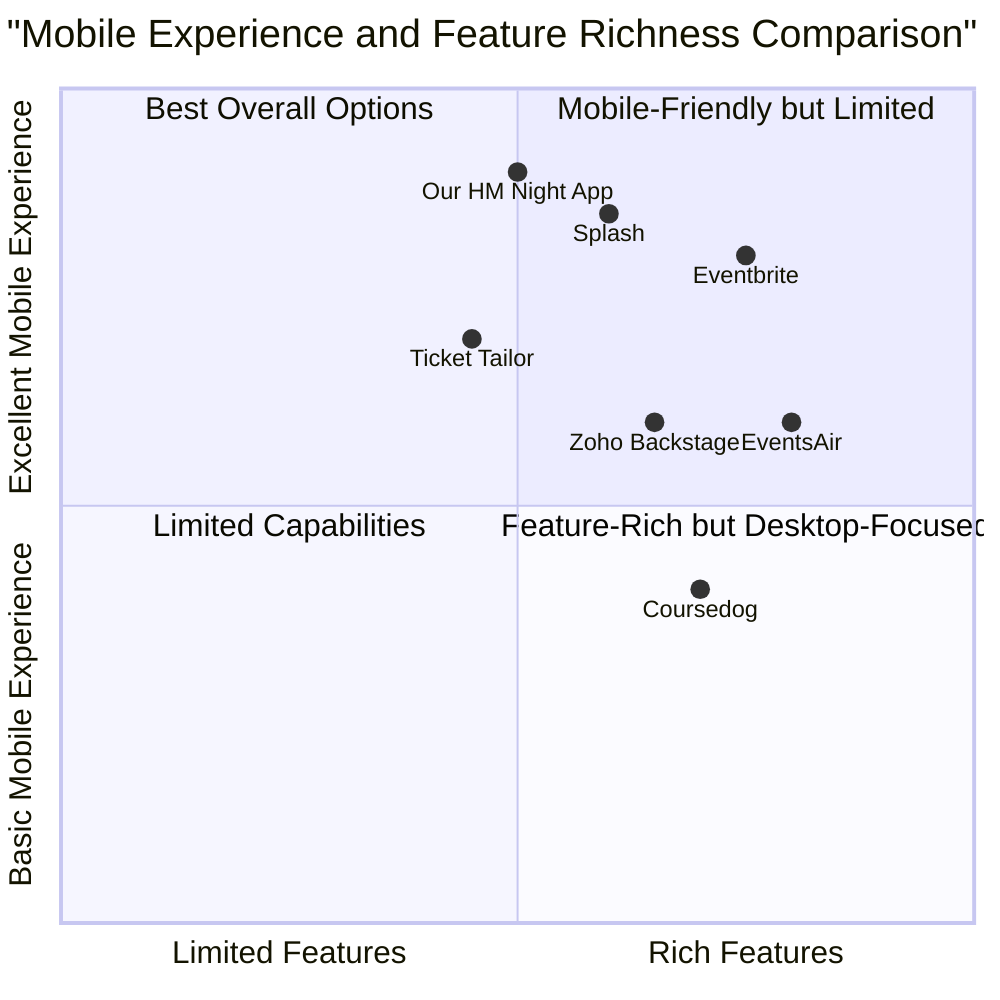

# Product Requirements Document: HM Night Event Ticket App

## Project Information

- **Project Name**: hm_night_ticket_app
- **Tech Stack**: React, JavaScript, Tailwind CSS, Supabase, Vercel
- **Original Requirements**: Build a web app for HM Night event that allows the president to register students (name, email), generate QR codes/barcodes, store data in Supabase, send email tickets, scan QR codes for attendance tracking, with a beautiful UI, animations, and responsive design for mobile.

## Product Definition

### Product Goals
1. Streamline the student registration and check-in process for HM Night events
2. Provide a secure and reliable ticketing system with QR code functionality
3. Deliver an aesthetically pleasing, responsive user experience across all devices

### User Stories
1. As an event president, I want to quickly register students by entering their name and email, so that I can efficiently process attendees.
2. As an event organizer, I want to generate unique QR codes for each registered student, so that I can facilitate secure check-in.
3. As an event staff member, I want to scan QR codes for quick check-in and have a manual search option, so that I can efficiently manage entry regardless of technical issues.
4. As a student attendee, I want to receive my ticket with QR code via email, so that I can easily access it on my mobile device.
5. As an administrator, I want access to attendance data, so that I can track event participation.

### Competitive Analysis

| Product | Pros | Cons |
|---------|------|------|
| **EventsAir** | - Comprehensive event management features<br>- Multiple ticket types<br>- Secure payment processing<br>- Global language support | - Enterprise pricing may be excessive for student events<br>- Complex interface with learning curve<br>- May have excessive features for simple events |
| **Ticket Tailor** | - Simple interface<br>- Low fees per ticket<br>- Good customer support<br>- Fast QR code scanning | - Limited advanced customization<br>- Fewer integration options<br>- Basic analytics |
| **Eventbrite** | - Wide market reach<br>- Comprehensive ticketing tools<br>- Detailed analytics<br>- Reliable QR scanning | - Higher fees per ticket<br>- Less customization for student-specific needs<br>- Potentially overwhelming for simple events |
| **Coursedog** | - Designed for higher education<br>- Comprehensive event management<br>- Public-facing calendars<br>- Automated workflows | - Less focus on mobile experience<br>- Expensive for single events<br>- Overkill for basic ticket needs |
| **Zoho Backstage** | - Event website builder<br>- Custom branding<br>- Mobile app builder<br>- Flexible pricing | - Less intuitive interface<br>- Configuration complexity<br>- Additional setup for QR scanning |
| **Splash** | - Beautiful designs<br>- Strong mobile experience<br>- Fast QR code scanning<br>- Good branding options | - Higher price point<br>- Complex feature set<br>- Possibly too robust for student needs |
| **Our HM Night App** | - Purpose-built for student events<br>- Simple, focused interface<br>- Optimized for quick registration<br>- Free for students<br>- Mobile-first design | - Limited to HM Night events<br>- Fewer marketing features<br>- No integrated payment processing<br>- Limited event customization |

### Competitive Quadrant Chart



## Technical Specifications

### Requirements Analysis

The HM Night Event Ticket App requires a streamlined system to handle student registration, QR code generation, attendance tracking, and basic email functionality. The application needs to be responsive, visually appealing, and operate seamlessly across devices with particular attention to mobile interfaces.

The system will have three main user roles:
1. **President/Admin**: Registers students and manages the event
2. **Check-in Staff**: Scans QR codes for attendance verification
3. **Student Attendees**: Receives and presents QR tickets

The application must function in both online and offline environments, particularly during the check-in process where internet connectivity may be limited. Security considerations include protecting student data while making the check-in process efficient.


### Requirements Pool

#### P0 (Must-have)
1. **Student Registration Form**
   - Input fields for student name and email
   - Form validation to ensure proper email format
   - Success confirmation animation after registration

2. **QR Code Generation**
   - Automatic generation of unique QR code for each registration
   - High contrast QR codes optimized for scanning
   - Visual animation when QR code is generated

3. **Database Integration**
   - Store student records in Supabase (name, email, QR code data, check-in status)
   - Secure data access with proper authorization
   - Real-time updates for attendance status

4. **QR Code Scanner**
   - Camera access for QR code scanning
   - Visual and audio feedback on successful scan
   - Update database in real-time when attendee is checked in

5. **Manual Check-in Option**
   - Search functionality by name or email
   - List view of registered students with check-in status
   - Quick-action buttons for manual check-in

6. **Responsive Design**
   - Fully functional on mobile devices
   - Touch-optimized UI elements (minimum 44x44px targets)
   - Adaptive layouts for different screen sizes

#### P1 (Should-have)

1. **Email Integration**
   - Template for ticket emails with QR code
   - Option to send tickets immediately after registration
   - Ability to resend tickets when needed

2. **Admin Dashboard**
   - Overview of registration and check-in statistics
   - Visual representations of attendance data
   - Filtering options for student data

3. **Animated UI Elements**
   - Smooth transitions between screens
   - Micro-interactions for user feedback
   - Loading animations while processing

4. **Offline Mode**
   - Ability to scan and record check-ins without internet
   - Data synchronization when connection is restored
   - Visual indicator of offline status

#### P2 (Nice-to-have)

1. **Dark Mode**
   - Light/dark theme toggle
   - Automatic theme based on system preferences
   - Theme-aware QR codes and UI elements

2. **Multi-event Support**
   - Ability to create and manage multiple HM Night events
   - Archive past events while maintaining data
   - Event-specific customization options

3. **Export Functionality**
   - Download attendance reports as CSV/PDF
   - Export student data for record-keeping
   - Batch email functionality for communications

4. **Custom Ticket Design**
   - Template editor for ticket appearance
   - Upload school/event logo and branding
   - Customizable color schemes

### UI Design Draft

#### Registration Page

```
+-------------------------------------------------------+
|                                                       |
|  [Logo]          HM Night Registration                |
|                                                       |
|  +-------------------------------------------+        |
|  |                                           |        |
|  |  Student Information                      |        |
|  |                                           |        |
|  |  Full Name: [                      ]      |        |
|  |                                           |        |
|  |  Email:     [                      ]      |        |
|  |                                           |        |
|  |                                           |        |
|  |  [       Register Student        ]        |        |
|  |                                           |        |
|  +-------------------------------------------+        |
|                                                       |
|                                                       |
|              [Switch to Scanner Mode]                 |
|                                                       |
+-------------------------------------------------------+
```

#### Ticket Generation View

```
+-------------------------------------------------------+
|                                                       |
|  [Logo]          HM Night Ticket                      |
|                                                       |
|  +-------------------------------------------+        |
|  |                                           |        |
|  |  Registration Successful!                 |        |
|  |                                           |        |
|  |  Student: John Smith                      |        |
|  |  Email: john.smith@example.com            |        |
|  |                                           |        |
|  |  +-------------------+                    |        |
|  |  |                   |                    |        |
|  |  |       QR CODE     |                    |        |
|  |  |                   |                    |        |
|  |  +-------------------+                    |        |
|  |                                           |        |
|  |  [Send Email]   [Download Ticket]         |        |
|  |                                           |        |
|  +-------------------------------------------+        |
|                                                       |
|           [Register Another Student]                  |
|                                                       |
+-------------------------------------------------------+
```

#### Scanner View (Mobile)

```
+-------------------------+
|                         |
|  [Logo]  HM Night Check-in |
|                         |
|  +-------------------+  |
|  |                   |  |
|  |                   |  |
|  |   CAMERA VIEWFINDER   |  |
|  |                   |  |
|  |                   |  |
|  +-------------------+  |
|                         |
|  Position QR code in    |
|  the frame to scan      |
|                         |
|  [Switch to Manual Mode]|
|                         |
|  Last checked in:       |
|  Emma Johnson - 3:45 PM |
|                         |
+-------------------------+
```

#### Manual Check-in View

```
+-------------------------------------------------------+
|                                                       |
|  [Logo]          HM Night Manual Check-in             |
|                                                       |
|  Search: [                                  ]         |
|                                                       |
|  Student List:                                        |
|  +-------------------------------------------+        |
|  | Name             | Email            |Status|       |
|  |------------------|------------------|------|       |
|  | John Smith       | john@example.com |  ✓   |       |
|  | Emma Johnson     | emma@example.com |  ✓   |       |
|  | Michael Brown    | mike@example.com |  -   |       |
|  | Sarah Williams   | sarah@example.com|  -   |       |
|  | ...              | ...              | ...  |       |
|  +-------------------------------------------+        |
|                                                       |
|  [Switch to Scanner Mode]   [Dashboard]               |
|                                                       |
+-------------------------------------------------------+
```

### Open Questions

1. **Event Details**: What specific information should be included on the ticket beyond student name and QR code?

2. **Email Functionality**: Should the system automatically send emails upon registration, or should this be a manual process initiated by the president?

3. **Multiple Check-in Points**: Will there be multiple check-in points requiring separate devices with synchronized data?

4. **Ticket Design**: Are there specific branding requirements or design elements that should be incorporated into the ticket?

5. **Data Retention**: How long should student registration and attendance data be retained after the event?

6. **Check-in Restrictions**: Should the system prevent duplicate check-ins or allow multiple entries for the same student?

7. **Capacity Management**: Is there a maximum attendance limit that should be enforced during registration?

8. **Internet Reliability**: What is the expected internet connectivity at the venue, and how critical is offline functionality?

## Implementation Timeline

### Phase 1: Core Functionality (3 weeks)
- System architecture and database setup
- Registration form and validation
- QR code generation
- Basic UI implementation

### Phase 2: Mobile Optimization & QR Scanning (2 weeks)
- Responsive design implementation
- QR code scanner functionality
- Manual check-in option
- Real-time database updates

### Phase 3: Enhanced Features & Polish (2 weeks)
- Email integration
- UI animations and transitions
- Admin dashboard
- Testing and performance optimization

## Success Criteria

1. Registration process completes in under 30 seconds per student
2. QR codes scan successfully on first attempt >95% of the time
3. System maintains responsiveness with up to 1000 registered students
4. Check-in process takes less than 5 seconds per student
5. UI receives positive feedback from user testing (minimum 80% satisfaction)
6. System operates successfully in offline mode when needed
7. Mobile experience rated as good or excellent by >90% of testers
